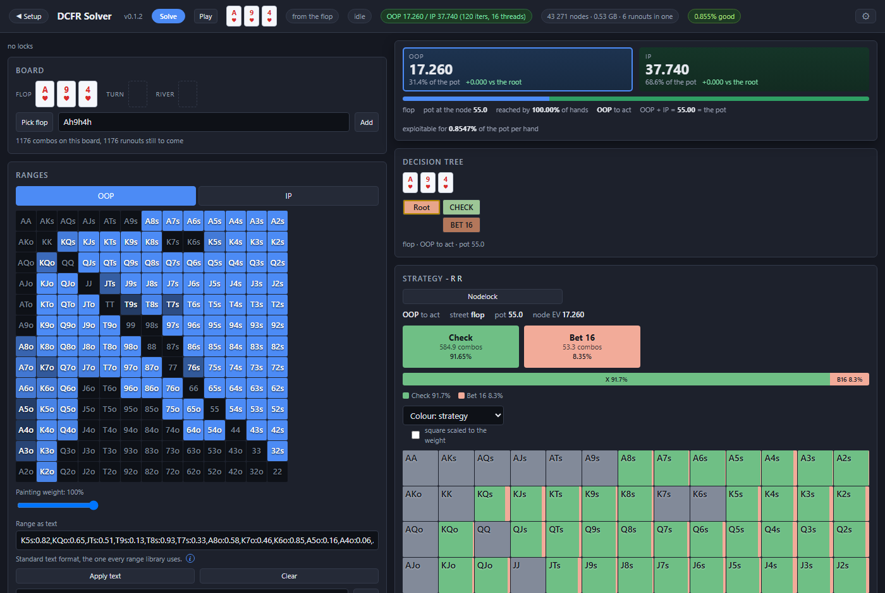
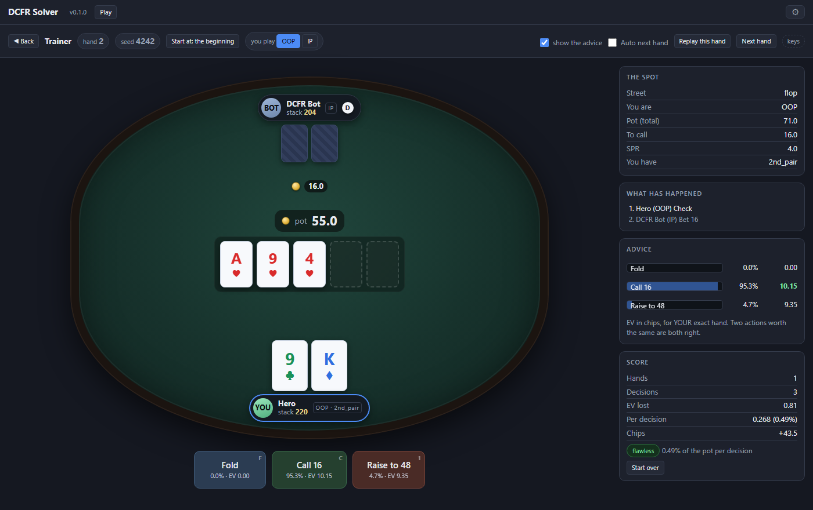

# DCFR Solver

[](https://github.com/PagaLaFanta/dcfr-solver/actions/workflows/build.yml)
[](https://github.com/PagaLaFanta/dcfr-solver/releases)
[](LICENSE)
[](#building-it-yourself)

A postflop solver for No Limit Hold'em. Full 52-card deck, full 1,326-combo
ranges, flop / turn / river, Discounted CFR. It runs **on your own machine** and
you drive it from your browser.

No dependencies: C++17 and the standard library. One binary, no installer, no
server, no account, no network.

**Double-click it and it opens in your browser.** From a terminal, `solver --gui`
does the same thing and plain `solver` gives you the text console.

### **[⬇ Download the latest build](../../releases/latest)**

Windows x64, one `.exe`, about 2 MB. Nothing to install. Windows will warn that
it is unsigned the first time — [why, and what to
click](#run-it). Or [build it yourself](#build-it): it takes thirty seconds and
one compiler.

> 🇪🇸 **[Este README en español](README.es.md)** · the interface itself speaks
> both languages — the gear in the top right switches instantly.

---



<p align="center"><em>The study screen: ranges on the left, the solved tree and the
strategy on the right.</em></p>



<p align="center"><em>And the trainer: you play the spot, the solution plays the other
seat, and the advice is there when you want it.</em></p>

---

## Contents

- [What it is](#what-it-is)
- [Quick start](#quick-start)
- [A five-minute tour](#a-five-minute-tour)
- [What it does, and what it does not](#what-it-does-and-what-it-does-not)
- [How it works](#how-it-works)
  - [The model](#the-model)
  - [Ranges and one shared indexing](#ranges-and-one-shared-indexing)
  - [The betting tree](#the-betting-tree)
  - [Tree-building rules](#tree-building-rules)
  - [Chance nodes and suit isomorphism](#chance-nodes-and-suit-isomorphism)
  - [Discounted CFR](#discounted-cfr)
  - [Memory](#memory)
  - [Threads](#threads)
  - [Showdown](#showdown)
  - [Equity](#equity)
  - [Exploitability and the accuracy target](#exploitability-and-the-accuracy-target)
  - [Rake](#rake)
  - [Nodelocking](#nodelocking)
  - [Made hands and draws](#made-hands-and-draws)
- [The interface](#the-interface)
- [Playing the tree](#playing-the-tree)
- [It will not run next to a poker room](#it-will-not-run-next-to-a-poker-room)
- [Solving many boards overnight](#solving-many-boards-overnight)
- [Performance](#performance)
- [Correctness](#correctness)
- [Reference](#reference)
- [Source map](#source-map)
- [Building it yourself](#building-it-yourself)
- [Limitations](#limitations)
- [Contributing](#contributing)
- [License](#license)

---

## What it is

A solver takes a spot — a board, two ranges, a pot, a stack and a set of legal
bet sizes — and computes a strategy that cannot be exploited much: what fraction
of the time each hand should bet, check, call, raise or fold at every node of
the tree.

This one is a single self-contained program. The engine is about 27,000 lines of
header-only C++17; the user interface is a web page the program serves to itself
over a socket on `127.0.0.1`. Nothing leaves your machine, and nothing needs to
be installed for it to run.

It is **not** a preflop solver and it does not play. You hand it a flop, turn or
river that is already dealt.

---

## Quick start

### Run it

1. Download `solver-windows-x64.exe` from the [Releases page](../../releases).
2. Put it in a folder of its own. The first time it starts it writes a
   `saves/` directory next to itself and drops the seven ranges it ships with
   into `saves/ranges/` — that happens on startup, before you save anything,
   so `Downloads` is a poor home.
3. **Windows**: double-click it. It opens `http://127.0.0.1:8777` in your
   browser. The first time, Windows will warn that the program is not signed
   (the blue SmartScreen panel): *More info* → *Run anyway*. Code-signing
   certificates cost money every year and this project has none. If you would
   rather not trust a binary, build it yourself — it takes thirty seconds.

4. **To stop it**: close the browser tab. This is a server, and the page is its
   window — when the last tab goes it says so in the console and exits a few
   seconds later. It will not do that while a solve is running, nor if no
   browser ever connected (`--no-open` stays up until you open the page
   yourself), nor because you left the tab in the background. `Ctrl+C` in the
   console works too.

Only Windows is published. The code has its POSIX branches and the CMakeLists
tells WIN32, MinGW and MSVC apart, so it will probably build elsewhere -- but
probably is not a promise and it is not offered as if it were tested. See
[Building it yourself](#building-it-yourself).

The program starts with a spot already loaded — A♥9♥4♥, pot 55, stack 220 — so
you can press **Solve** and have a strategy in front of you in about ten seconds
(10.2 to 12.0 s over three runs on the author's machine, 16 threads).

### Build it

You need a C++17 compiler. That is the whole dependency list.

```bash
cmake -B build -DCMAKE_BUILD_TYPE=Release && cmake --build build
```

or, by hand on Windows with MinGW:

```bash
g++ -std=c++17 -O3 -march=native -Wall -Isrc -static -o solver src/main.cpp -lws2_32
```

See [Building it yourself](#building-it-yourself) for what each flag is doing
and why `-static` is not optional on Windows.

---

## A five-minute tour

1. **BOARD** — click *Pick flop* and choose three cards, or type
   `Ah 9h 4h`. Three cards solve from the flop, four from the turn, five from
   the river.
2. **RANGES** — paint the 13×13 grid, or paste text: `AA,KK,AKs,A8o:0.5`. The
   grid and the text are the same thing in two windows; whatever you paint comes
   back out as text you can paste anywhere else. Hover a square and it tells you
   the weight it carries.
3. **TREE SETUP** — starting pot, effective stack, and the bet and raise sizes
   for each player on each street. Sizes are **per cent of the pot** (`50` is
   half pot) and are truncated to **whole chips**, the way a real table works.
4. **Accuracy target (% of pot)** — leave it at `1` with the box ticked. That reads
   "solve until it is exploitable for less than 1% of the pot, then stop", which
   is a much better instruction than a number of iterations.
5. **Build tree** — it tells you how much memory the tree will take *before*
   allocating it, and what to cut if you are over the limit.
6. **Solve**.
7. Walk the tree. Click a hand to see its individual combos; click a made-hand
   category to see only those.
8. **Nodelock**: drag the bar of a category — "two pair bets 90%" — and solve
   again. The rest of the tree adapts around what you pinned; each lock has its
   own ↺ to undo it.

---

## What it does, and what it does not

**It does:**

- Solve **flop, turn or river** with complete ranges.
- Build trees with per-player, per-street bet and raise sizes, **donk bets**,
  bare **all-in** branches, and a "don't 3-bet" switch for IP.
- **Nodelocking** at any node, combo by combo, with the rest of the tree
  re-solving around it.
- Stop on an **accuracy target** instead of a guessed iteration count.
- **Rake** with a cap, on the matched pot.
- Save and load **ranges** (both sides at once, because a range is a spot),
  **configs** (the setup) and **trees** (the whole solution, resumable).
- Let you **play the solved tree** against the solution, with the advice on
  or off, a score at the end and any node as the starting point.
- Solve **a list of boards unattended** — it writes you a script and you leave
  it running overnight.
- Speak **Spanish or English**, switched instantly from the gear, with the
  choice remembered in your browser.

**It does not:**

- Play or solve **preflop**.
- Ship preflop range charts or an opening-range solver.
- Do multiway pots. Two players only.
- Do ICM, training modes, or anything multiplayer.

---

## How it works

### The model

Two players, one board, no preflop. The board length picks the depth of the
game:

| board | game |
|---|---|
| 5 cards | river only |
| 4 cards | turn, then river |
| 3 cards | flop, then turn, then river |

Everything below the starting street is **chance followed by another betting
round**: a flop solve contains 49 turn cards, each containing 48 river cards,
each containing a river betting tree. That fan-out — 49 × 48 = 2,352 ordered
runouts, 1,176 distinct turn–river pairs — is where all the memory and all the
time go, and most of the engineering in here is about it.

### Ranges and one shared indexing

A range is a **weight vector over the combos that survive the base board**, and
zero simply means "not in my range". Both players, every node and every runout
use that same indexing, so nothing in the CFR core has to translate between two
players' combo lists.

On a three-card board there are 1,176 such combos (49 choose 2). When a chance
node deals a card, the combos that use it get zero reach from that point down —
they are not removed, they just stop existing in the arithmetic.

Range syntax:

```
AA  KK  AKs  AKo  AK          classes
QQ+  AJs+  KTo+               open-ended
55-88  T9s-76s  A5s-A2s       intervals
AsKd                          one exact combo
anything:0.5                  partial weight
random / all                  everything
```

Ten is `T` or `10`, both work. What the grid produces is exactly this syntax, so
it round-trips through any other tool that speaks it.

### The betting tree

The betting tree of a street is **identical for every runout that reaches it** —
same pot, same sizes, same shape — so it is built once as a template and the
information-set memory is indexed by `(template node, runout instance)`.
Materialising 2,352 copies of the river subtree would cost hundreds of megabytes
in node metadata alone, before a single regret is stored.

A **context** is one betting round reached by one line of continuations:

```
ctx 0        the starting street
ctx 1..n     the next street, one per continuation of ctx 0
...
```

and inside a context, an instance is a runout:

```
instance(child) = instance(parent) * deckN + card_slot
```

so the instance index of any node follows straight from the cards dealt, with no
lookup table.

Node types are `DECISION`, `CONT` (the chance node that moves to the next
street), `SHOWDOWN` and `FOLD`. Actions are `Fold`, `Check`, `Call`, `Bet`,
`Raise`, written `F X C B R` with the size appended where there is one: `B33`,
`R48`.

### Tree-building rules

These are the rules that decide what the tree actually contains. They are the
part people most often want to check, so they are all in one place here and all
covered by the check suite.

- **Bet sizes are per cent of the pot.** `50` is half pot, `300` is three pots.
- **Raise sizes are `Nx`**: N times what you have to call, on top of what you
  already have in. Over a bet of 100, `3x` is 300; if they raise again, 700,
  then 1,500. `min` is the smallest legal raise and comes out the same as `2x`.
  This is the standard count.
- **Everything truncates to whole chips.** 25% of a pot of 250 is 62.5 and the
  tree builds 62. Truncating rather than rounding means a size never bets *more*
  than you asked for. The all-in is never touched: if you have 250.5 behind, the
  all-in is 250.5. One consequence worth knowing: a size that lands below one
  chip does not exist — on a pot of 20, the smallest that fits is 5%.
- **All-in threshold.** A bet or raise that would commit more than
  `allinpct` of the **starting effective stack** becomes a clean all-in instead.
  The default is 0.67: with two thirds of your stack in the middle you are
  committed, so the third left behind buys no decision, only branches. `1` turns
  the rule off; `0` makes every bet an all-in.
- **Near-duplicate sizes merge.** Two sizes within 10% of the larger one are the
  same bet with extra steps; the smaller wins and the branch is not duplicated.
  That constant was measured, not chosen: on `0.5,3x` raises over a 12 bet in a
  20 pot the two land on 34 and 36, and the tree goes from 164 nodes to 112 the
  moment they merge. Below 0.10 the near-duplicate survives and costs a third of
  the tree for nothing; above 0.20 it starts eating raises that really are
  different.
- **Donk bets** are OOP leading into the previous street's aggressor, with their
  own sizes. They do not exist on the street the solve starts on, because nobody
  was aggressive before it.
- **`no3bet`** stops IP from making the *third* aggressive action of a street
  (IP bets, OOP raises, IP stops). It is an IP-only switch.
- **Depth bound.** There is no user-facing cap on bets and raises and there does
  not need to be: every raise is at least as big as the one it answers, so the
  stack runs out, and the all-in threshold ends the chain earlier still. Measured
  on a 20-chip pot, the deepest a round actually goes is 3 levels at 100bb and 10
  at 2000bb. The hard bound of 24 levels exists for the sizing that does not
  terminate in any useful sense — a bet of a thousandth of the pot, min-raised to
  the ceiling.
- **Branching bound.** `MAX_ACTIONS = 8` per node. Ask for more and the build is
  refused with a message naming the node, rather than quietly dropping an action.

### Chance nodes and suit isomorphism

At a chance node,

```
v(h) = (1/D) · Σ  v(h | c)      over every dealable c not in h
```

with `D = 52 − |board| − 2`, and every combo using `c` getting zero reach below
it.

Two runout cards are **strategically identical** when some permutation of the
suits maps the board onto itself and one card onto the other. Only one card per
orbit is solved and stored; the others are read back through the permutation.
The permutations that fix a board are the ones permuting suits that carry
identical rank sets, so the saving comes from the suits *absent* from the board:

| flop | free suits | group | saving |
|---|---|---|---|
| monotone (A♥9♥4♥) | 3 | 6 | ~6× |
| two-tone | 2 | 2 | ~2× |
| rainbow | 1 | 1 | none |

The catch is that it is only valid if **the ranges are invariant under that same
group** — and that is checked, not assumed. A range with `AhKh` in it but not
`AsKs` breaks the symmetry and the collapse is dropped for that group.

This is always on (`set iso off` exists for testing). What varies is how much
there is to gain, which is why the interface says "suits collapsed ×6" on one
board and nothing on another.

### Discounted CFR

The solver is **Discounted CFR** (Brown & Sandholm, 2019) with the paper's
default hyper-parameters:

| parameter | value | what it discounts |
|---|---|---|
| α | 1.5 | positive cumulative regret |
| β | 0.0 | negative cumulative regret |
| γ | 2.0 | the average strategy |

Implementation notes that matter for speed and memory:

- **Two buffers only**: cumulative regret and cumulative strategy, both
  `float`. The current strategy is regret-matched on the fly and the average
  strategy is normalised on demand, so neither costs a third buffer.
- **Alternating updates**: iteration *t* traverses for one player only. That is
  what the paper uses, it halves the per-iteration cost, and it removes the need
  to freeze a shared current strategy between two traversals.
- **A node's block holds one entry per action per combo its owner can hold**,
  not per combo on the board. A board offers 1,176 and a real range has a couple
  of hundred, so that alone is worth about 6×.
- **Deferred discounting.** Discounting every entry at the end of every
  iteration would mean sweeping the whole buffer — gigabytes — for arithmetic
  that only matters where the traversal actually goes. Instead each block carries
  a stamp of how many discounts it has absorbed, and the traversal brings it up
  to date when it arrives. The strategy sum never gets swept at all: its discount
  is a single scalar applied to the increment.

### Memory

This is the thing that surprises everyone. A flop with wide ranges, two bet
sizes, raises and an all-in is easily **2–3 GB**, and bigger trees go much
higher. It is the nature of the problem, not a defect.

The size is exactly:

```
bytes = 2 × 4 × Σ over contexts [ instances × Σ over decision nodes (actions × live combos of the owner) ]
```

The program computes that **before allocating anything** and shows it to you.
The limit defaults to **75% of the machine's physical RAM** — 24 GB on a 32 GB
box, 6 on an 8 GB one — so there is normally nothing to configure. Over the
limit, the build is refused with the number and a suggestion of what to cut.

Asking for a tree you cannot hold used to mean the allocation either threw
somewhere unhelpful or, on Windows with a big pagefile, quietly succeeded and
then thrashed the machine to a standstill — which is worse, because there is
nothing to read and nothing to cancel.

### Threads

A **persistent thread pool**, created once. Spawning threads per parallel
section was costing more than the work itself on small trees: a turn iteration
fans out at four points, so at 16 threads that was 64 thread creations for 2.4 ms
of work.

The fan-out at chance nodes is where the work is parallelised — the subtrees
under one chance node touch disjoint memory, so there are no locks in the hot
path. Work is handed out by an atomic counter, because an uneven fan-out (a
monotone flop has orbits of very different sizes) would otherwise leave threads
idle. The calling thread takes part as worker 0, so `threads = N` uses N cores
including the one that asked.

`set threads 0` means "every core". Lower it to keep some free for whatever else
you are doing.

### Showdown

Hand strength depends on the final five-card board, so it is precomputed once
per runout: the score of every combo, plus the combos sorted by that score. The
showdown value of a whole range against a whole range is then a single **O(N)
sweep** over the sorted order rather than an O(N²) comparison of every pair.

### Equity

Equity is computed **per node**, against the range the opponent actually arrives
there with — which changes with every action. The same hand on the same board is
worth different numbers at different nodes, and all of them are correct:

On `Ah9h4h`, AA is worth 85% against the starting range, less against a range
that called a bet, less still against one that raised. If a number looks wrong,
check which node you are standing on first.

The base calculation is verified three independent ways: the engine's own
`compute_equity`, a brute-force enumeration of every turn and river
(`tools/eqcheck.cpp`), and an outside solver.

### Exploitability and the accuracy target

The solver reports **how exploitable** the current strategy is, as a percentage
of the pot. Lower is closer to equilibrium.

The number shown is the **average of the two best responses**, which is the
convention every published solver uses, so a 0.5% here is a 0.5% anywhere.
Internally the engine computes the *sum*; the factor of two is applied at the
point of display and in the accuracy target. If you compare raw console numbers
from two different tools, that factor is the first thing to check.

**Exploitability does not fall monotonically.** This is true of CFR generally and
is not a bug. Measured here on one flop, it went from 0.0042 at 1,810 iterations
to 0.0618 at 1,880 — fifteen times worse for doing more work — and took another
two thousand iterations to recover. The average strategy weights recent
iterations more heavily (that is γ), so it tracks a current strategy that is
still moving. This is exactly why an accuracy target is a better stopping rule
than an iteration count, and why the iteration cap is best treated as a safety
net rather than a plan.

A wall-clock **timeout** is available too (`set timeout`), which is what makes a
twenty-board overnight list actually finish: without it, one board that never
reaches the target eats the hours meant for the others.

### Rake

Off by default, because a solve without rake is the right model for a tournament
and for pure theory. For cash it is not a missing feature but a wrong one: rake
makes marginal calls worse and shifts continuation thresholds, and small pots
feel it most.

`set rake <pct>[,<cap>]` takes a percentage of the **matched** pot with an
optional ceiling in chips. Matched matters: an uncalled bet goes back to the
bettor before the house takes anything, exactly as at a real table.

### Nodelocking

A lock fixes what part of a range does at one node, and the rest of the tree
re-solves around it.

Two rules, both measured:

- **Upwards, everything is recomputed.** Freezing a river changes what betting
  the turn is worth, and the turn finds out. Locking one river out of 48 moves
  the turn bet by 0.019 on average; locking all 48 moves it 0.190 — ten times
  more, for 48 times more future touched.
- **Downwards, nothing is inherited.** Locking the turn leaves the rivers free.

And the rule people trip over: **a lock belongs to the exact node you are
standing on, dealt card and all.** Locking the 3♠ river does not lock the 3♥.
Navigate to the runout you mean first (`cd 3s`, or click the card in the tree).

In the interface you can lock by dragging a category bar ("two pair bets 90%")
or by painting individual combos in the grid, with the weight you choose. Locks
take effect on the next solve, and each one can be undone on its own.

### Made hands and draws

The report groups a range into made-hand categories and draw categories — and
they are **two independent lists**, not one crossed list. A hand that is a set
*and* a flush draw appears in both; there is no "set + flush_draw" category,
because that is not a thing anyone studies.

The categories are the standard ones, spelled the standard way, and the spelling
is itself checked letter by letter by the suite (there are enough tools in this
space that disagree on `2nd_pair` versus `2nd-pair` to make it worth pinning).

Rows come from the **board**, not from your range: a category that is possible
on this board is listed even if you hold none of it. On A-K-6 that means "set,
0.0 combos", which tells you something — there are sets here and you have none —
whereas hiding empty rows makes "impossible" and "I have none" look identical.

---

## The interface

### The web UI

The program serves a single self-contained HTML page over a socket on
`127.0.0.1`, from a **hand-written HTTP server** — no framework, no CDN, no
external asset. The page is about 4,000 lines of HTML, CSS and plain JavaScript
compiled into the binary as a string.

It has: the 13×13 range grids, the tree browser, the strategy grid coloured by
action, equity and EV painted into the cells, the made-hand and draw report with
draggable category bars, the nodelock dialog with per-suit combo painting, the
save/load panels, and a gear holding every advanced option — memory limit,
threads, iteration cap, timeout, all-in threshold, rake — plus the language
switch.

Both languages live in the same page: the markup is Spanish and a table maps it
to English, with a `MutationObserver` translating anything that appears later.
The engine's own messages are bilingual too, chosen per request from what the
page asks for, so an error never arrives in the wrong language.

### The console

Everything the interface can do, the console can do, and a few things only it
can do (`lines`, `freqs`, `br`, `csv`). `solver` with no arguments gives you a
prompt; `help` lists the commands; see [Reference](#reference).

### Files it writes

Next to the binary, created on first use:

```
saves/
  ranges/NAME.rng     both ranges, OOP and IP, as text
  configs/NAME.cfg    the setup: board, ranges, sizes, pot, stack (a few KB)
  trees/NAME.tree     setup + full solution, resumable (hundreds of MB to GB)
```

They are plain files. `.rng` and `.cfg` are text you can read and edit in
Notepad. The seven starter ranges shipped in the binary are written into
`saves/ranges/` **only if that folder has no ranges at all**, so yours are never
touched and one you delete does not come back.

---

## It will not run next to a poker room

Every poker room's terms forbid real-time assistance while you play, and they
are right to. A solver open beside the table is grounds for confiscated funds
and a closed account.

So the program refuses. On start it looks at the running processes, and if it
finds a poker client it does not open:

```
  This does not open with a poker room running: PokerStars.

  Every poker room's terms forbid real-time assistance while you
  play. This program is for studying before and after, not during.
```

If you open a room while it is already running, it closes itself within three
seconds and says why.

Covered: **PokerStars, GGPoker, Winamax, 888poker, CoinPoker and iPoker**
(Titan, Red Star, Betfair, William Hill, NetBet). The list is a table of brand
fragments at the top of [`src/rooms.hpp`](src/rooms.hpp) -- a room that is
missing is one line.

It matches **brands**, never the bare word "poker": PokerTracker, Hold'em
Manager, Hand2Note, Flopzilla, GTO+ and every other study tool keep working,
and the suite checks exactly that -- a false positive there would make the
program useless for the people who use it properly.

**What this is and what it is not.** It stops the accident -- the room left
open from before, the table in the background you forgot about, the "I'll just
check one thing". That is how it actually happens. It does not stop anyone
determined to get around it: the code is free and rebuilds in thirty seconds.
It does not claim otherwise.

---

## Playing the tree

Reading a strategy and playing it are not the same thing. In front of the grid
everything looks obvious; with one hand in your hand, a pot, and someone who just
raised, it is not.

**Play** deals you a hand out of your range, sits you in the spot, and the
solution plays the other seat.

```
              DCFR Bot   IP   stack 204
                 [] []
                   16                      <- what it just bet
         A♥  9♥  4♥  Q♣  [ ]     pot 87
                   0
                 A♠ K♦
              Hero   OOP · top_pair   stack 204

           [ Fold ]  [ Call 16 ]  [ Raise 48 ]
```

- **DCFR Bot plays the solution.** At every one of its nodes it rolls a die with
  the frequencies of *its own hand*. It is not trying to catch you out — it does
  not know what you have — which is exactly why one hand tells you nothing and a
  hundred tell you everything.
- **The advice, when you want it.** The frequency and the EV of every action,
  for your exact hand, taken straight out of the solve — the same numbers the
  grid paints. Turn it off and you are on your own; it is not sent to the browser
  at all while it is off, so there is nothing to peek at.
- **The score is EV, not frequency.** With a hand the solver bets 70% of the
  time, checking is *not* a mistake if checking is worth the same. Actions that
  get mixed are mixed *because* they are worth the same, and scoring against the
  frequency would punish what the theory calls indifferent — which is how you
  learn superstitions. Every decision is scored as `EV(best action) − EV(yours)`
  for the hand you actually held, in chips. That is what costs money.
- **The review.** At the end of the hand, one row per decision: what you did,
  what was best, what it cost.
- **Start anywhere in the tree.** By default the hand starts where the solve
  starts. *Start at…* walks you down the tree so you can drill one spot — "the
  turn after I bet and got called" — over and over. The hand is then dealt from
  the range that **reaches that node**, not from the starting range, so you get
  the hands that really play there.
- **The keyboard.** `F` fold, `X` check, `C` call, `1` `2` … the bet and raise
  sizes in order, `N` next hand, `R` replay this one, `A` toggle the advice. Each
  key is printed in the corner of its own button, and nothing fires while you are
  typing in a field.
- **The seed.** Every hand shows one, and *Replay this hand* deals it again:
  same cards, same runout, same die. It is the only way to go back to the hand
  you butchered and find out what the other line was worth.

Your grade is the EV you leave behind per decision, as a percentage of the pot.
Under 0.5% is flawless; over 5% there is a leak worth finding.

---

## Solving many boards overnight

A big flop takes minutes. Twenty of them take what they take, and you are not
going to sit there. The **Many boards…** button next to *Solve* writes you a
script; you run the script from a terminal.

```bash
solver --script my-list.txt
```

From start to finish:

1. **Build the spot** on screen as usual — a sample board, the ranges, the
   sizes, the pot and the stack. That is what every board in the list will use.
2. Open **Many boards…** and paste the list, one per line. *Random flops* fills
   it for you: none repeated, and none that is another one with the suits
   renamed — those have the same solution and would cost double for nothing.
3. Say **when to stop** on each board: by accuracy, by time, or both. The first
   one to hit wins. The time cap is what makes the list fit in a night.
4. **Generate**. Your spot is saved as a config under the name you give it and
   the script loads it in its first line, so the file stays short and readable
   and the spot is something you can open again.
5. **Download**, and run it. Each solved board is saved as a tree in
   `saves/trees`. In the morning you open them from **Save → Saved trees**.

The script is plain text and is just console commands, so you can edit it:

```
load config my-spot
set accuracy 0.5
set stopacc on
set timeout 600

echo === 1/2  Ah9h4h
board Ah9h4h
solve
save tree Ah9h4h

echo === 2/2  Kd7c2s
board Kd7c2s
solve
save tree Kd7c2s

echo === finished the list of 2 boards
```

`echo` stamps the wall-clock time, which is the point: by morning the log is a
thousand lines and what you need to know is which board it was on and when. If
the closing line is not there, it did not finish — no counting required.

**Disk.** A flop tree is hundreds of megabytes or gigabytes — the save panel
tells you exactly — and twenty boards are twenty times that. If you only want to
time the list, generate the script without saving trees.

---

## Performance

Measured on the author's machine (Windows, MinGW, `-O3 -march=native`). Run
`solver --bench` to get the numbers for yours instead of believing these.

All three on the same spot -- A♥ 9♥ 4♥, pot 55, stack 220, the ranges the
program opens with -- stopping on the 1%-of-pot accuracy target, on 16 threads:

| starting street | tree | pressing Solve |
|---|---|---|
| river | 8 nodes, 0.02 GB | **1.5 s** |
| turn | 883 nodes, 0.05 GB | **1.6 s** |
| flop | 43,271 nodes, 0.53 GB | 143 iterations, **11 s** |

Three runs each; the flop landed between 10.2 s and 12.0 s.

The river and the turn take the same time despite the difference in size, and
that is not the solving. Measuring exploitability costs a full pass of the tree
for each player, so the solver measures it **at most once every 1.5 seconds**.
On a river the target is met within the first few dozen iterations and what you
wait for is that check, not the work. On a flop, where one iteration costs about
80 ms, the check is free by comparison and the number below is the solving.

The flop is a monotone board with 699 and 598 live combos, which is a wide
spot; the suits collapse ×6 on it. A big tree with wide ranges runs into
minutes and gigabytes -- the number the interface shows before it builds is the
one to plan around.

`--bench` can also `--save` a baseline and `--vs` compare against it, which is
how a change gets proven not to have cost speed.

---

## Correctness

### The check suite

```bash
solver --check
```

**1,480+ assertions**, and it exits non-zero if anything moved. It is not a unit
test file bolted on afterwards; it is the place where the engine's rules are
written down. It checks the poker (hand evaluation against a brute-force
enumeration, category names letter by letter, equity three ways), the maths
(zero-sum at every node, best response bounds, the exploitability convention),
the tree (node counts, the raise ladder, truncation, merging, donk suppression),
the plumbing (save/load round-trips, config parsing, every console command on a
fresh session), and the interface (that every Spanish string has an English one,
that the page writes its numbers through one formatter, that the observer that
translates late-arriving text is actually installed).

Assertions are named as sentences, so a failure reads like a statement of what
broke:

```
FAIL  and one deleted by hand never comes back
        con seis guardados se rellenaria el septimo
```

### Mutation discipline

A check that passes while guarding nothing is worse than no check, because it
buys confidence that is not there. So every check added to this project is
**verified by breaking the thing it guards** and confirming it goes red. Several
checks in here have been tightened after failing that test — one matched
`new MutationObserver` anywhere in the page, and passed happily with a
`false &&` in front of it; one counted folded notes instead of requiring every
long note to be folded; one asserted that the help mentions `echo` rather than
running `echo`.

The commit messages record what was measured and what was deliberately broken to
prove the check works.

### External validation

The engine is also put side by side with an independent commercial solver on the
same spot, with the same tree and the same ranges, and the numbers compared:

| | reference | this solver |
|---|---|---|
| game value, river | 50.396 | 50.3958 |
| game value, turn with two sizes | 55.150 | 55.1494 |
| game value, flop to river | 52.913 | 52.9137 |
| IP calls a bet of 33 | 0.8138 | 0.8138 |
| OOP re-raises over a raise | 0.1158 | 0.1154 |

Trees are compared **node by node** — same node count, same actions at each one,
including donk suppression — because two solvers that build different trees will
differ for reasons that have nothing to do with solving.

That exercise found two real engine bugs that no internal check could have
caught, which is the entire argument for doing it.

---

## Reference

### Command line

```
solver --gui [port]    the browser interface (default port 8777)
                       --no-open skips launching the browser
solver                 interactive text console
solver --script FILE   run console commands from a file, then exit
solver --bench [board] timings for a standard spot
                       --save NAME keeps a baseline, --vs NAME compares
solver --check         regression checks; exit code 1 if anything moved
solver --help
```

Console commands can be piped: `echo solve | solver`.

### Console commands

**Spot**

| command | what it does |
|---|---|
| `show` | board, ranges, sizes, tree size, locks |
| `board <cards>` | 3 cards = flop solve, 4 = turn, 5 = river |
| `range oop\|ip <spec>` | set a range |
| `set pot\|stack <x>` | the geometry |
| `set bets [oop\|ip] [street] <pct,..>` | bet sizes, per cent of pot |
| `set raises [oop\|ip] [street] <Nx\|min,..>` | raise sizes |
| `set donks [street] <pct,..>` | OOP leading into the aggressor |
| `set no3bet [street] on\|off` | IP skips the third aggressive action |
| `set allin [oop\|ip] [street] on\|off` | a bare all-in branch |
| `set allinpct <f>` | the all-in threshold (0.67) |
| `set rake <pct>[,<cap>]` | house cut of the matched pot |
| `set maxmem <gb>` · `set threads <n>` · `set iso on\|off` | limits |
| `set accuracy <pct>` · `set stopacc on\|off` | the accuracy target |
| `set iters <n>` · `set timeout <secs>` | the safety nets |
| `build` · `estimate` | rebuild, or just report the size |
| `lines [file]` · `freqs [n\|all\|file]` | every line of the tree |
| `flops [n]` | random flops, no two isomorphic |
| `echo <text>` | a log line with the time of day |

**Solving, navigation, reading**

| command | what it does |
|---|---|
| `solve [n]` · `iterate <n>` · `expl` | run it |
| `tree` · `ls` · `pwd` · `up` · `cd <action\|card\|/>` | walk it |
| `freq` · `hands [n]` · `combos [n]` · `grid [code]` | read it |
| `made` · `br [n]` · `runouts` | the report, the best response, the cards |
| `report [file]` · `csv <file>` | dump it |

**Saving and locking**

| command | what it does |
|---|---|
| `save range\|config\|tree <name>` · `load config\|tree <name>` | persistence |
| `saves` · `delete config\|tree <name>` | manage it |
| `lock <sel> <act=p,...>` · `unlock [all]` · `locks` | nodelocking |

Lock selectors: `NUTS`, `VALUE`, `BC`, `AIR`, a made-hand or draw category
(`lock two_pair B=90%`), or any range expression. Actions are `F X C B R`, or
the exact code when a street has two sizes (`B33=0.9`).

### Limits and defaults

| | |
|---|---|
| `MAX_ACTIONS` | 8 per node |
| `MAX_RAISE_LEVELS` | 24 per street |
| merge threshold | 10% |
| all-in threshold | 0.67 of the starting stack |
| DCFR α / β / γ | 1.5 / 0.0 / 2.0 |
| memory limit | 75% of physical RAM |
| port | 8777 |

---

## Source map

Header-only, so the build is one translation unit.

| file | lines | what lives there |
|---|---|---|
| `src/main.cpp` | 211 | entry point, CLI, memory limit from the machine |
| `src/config.hpp` | 114 | every runtime setting and why its default is its default |
| `src/msg.hpp` | 45 | the bilingual message mechanism |
| `src/cards.hpp` | 627 | cards, hand evaluation, made-hand and draw categories |
| `src/deal.hpp` | 720 | combos, runouts, per-runout strength, suit isomorphism |
| `src/range.hpp` | 285 | range syntax, parsing and printing |
| `src/tree.hpp` | 863 | the betting tree: contexts, instances, building rules |
| `src/solver.hpp` | 1,580 | Discounted CFR, the thread pool, best response |
| `src/report.hpp` | 768 | the strategy report, grouped by hand class and category |
| `src/session.hpp` | 2,613 | the object the UI and the console both drive |
| `src/console.hpp` | 1,171 | the text console |
| `src/webui.hpp` | 1,477 | the HTTP server and the JSON endpoints |
| `src/webui_page.hpp` | 3,996 | the interface itself, page and all |
| `src/default_spot.hpp` | 53 | the spot it opens with |
| `src/default_ranges.hpp` | 53 | the starter ranges |
| `src/bench.hpp` | 390 | `--bench` |
| `src/check.hpp` | 11,568 | `--check` |

Comments are in Spanish; identifiers, messages and documentation are in English.

---

## Building it yourself

### CMake, anywhere

```bash
cmake -B build -DCMAKE_BUILD_TYPE=Release
cmake --build build --config Release --parallel
```

`-DPORTABLE=ON` drops `-march=native`, which is what you want for a binary
someone else will run.

### Windows, by hand

```bash
g++ -std=c++17 -O3 -march=native -Wall -Isrc -static -o solver src/main.cpp -lws2_32
```

```powershell
.\build.ps1 -Gui
```

`-static` is not optional on Windows. Other toolchains on your PATH (Git, Qt…)
ship an incompatible `libstdc++-6.dll`, and without it the binary starts with
whichever one it finds first.

`-Wall` is not decoration either: the warning it brings is the one that catches a
stray `%` inside a `printf` with no argument, which is how the console help once
printed `less than this 25235616201f the pot`. It compiles without a single
warning; if one appears, something broke.

### Linux / macOS, by hand

```bash
g++ -std=c++17 -O3 -march=native -Wall -Isrc -pthread -o solver src/main.cpp
```

### CI

Every push builds on **Ubuntu, macOS and Windows** and runs the full check suite
on each. Tagging a version publishes binaries for the three of them:

```bash
git tag v0.1.0 && git push origin v0.1.0
```

---

## Limitations

- **Two players, postflop only.** No preflop, no multiway.
- **Memory is the binding constraint**, not time. Big flop trees want more RAM
  than most laptops have; start from a turn or a river to see the program work.
- **Exploitability is not monotone in iterations** — use the accuracy target.
- The Windows binary is **unsigned**, so SmartScreen will warn on first run.
- macOS binaries are unsigned and unnotarised, so Gatekeeper will object; build
  from source there if that matters to you.
- The interface assumes a desktop-sized window. It works on a phone; it is not
  designed for one.

---

## Contributing

Issues and pull requests are welcome. Two house rules, which are the reason the
thing works at all:

1. **Measure first.** A change justified by "should be faster" is not justified.
   `--bench --save` before, `--bench --vs` after.
2. **Every fix brings a check, and the check must be proven.** Break the fix on
   purpose, watch the new check go red, put it back. A check that does not catch
   its own mutation is worthless and has to be tightened.

`solver --check` must be green before anything is committed.

---

## More documentation

- **[FAQ](docs/FAQ.md)** -- the questions everybody asks:
  accuracy, memory, why a size truncates, why equity differs per node,
  what the suit collapse is doing.
- **The headers themselves.** Every rule in the engine has the reason it is
  that rule written next to it, with the measurement that decided it. That is
  where the real documentation lives.

---

## License

GNU General Public License v3. It is free software: you may use it, study it and
modify it. If you distribute a modified version, you must publish your source
under the same licence.

No warranty of any kind. See [LICENSE](LICENSE).

Copyright © 2026 PagaLaFanta.
